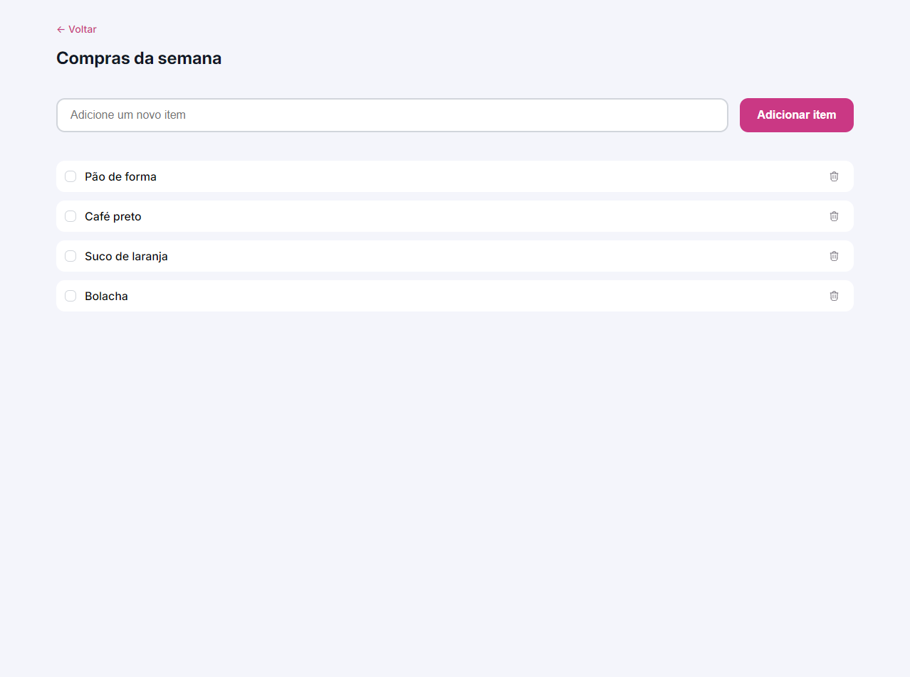

# quicklist - Lista de compras

> Jornada Full-Stack

O projeto é um site responsivo de lista de compras onde o usuário pode gerenciar os itens adicionando e removendo eles. 

[Clique aqui para acessar](https://pedro-k.github.io/QuickList/)

## Tecnologias

- HTML
- CSS
- JavaScript
- Git e Github

pedro.kleinfelder@hotmail.com